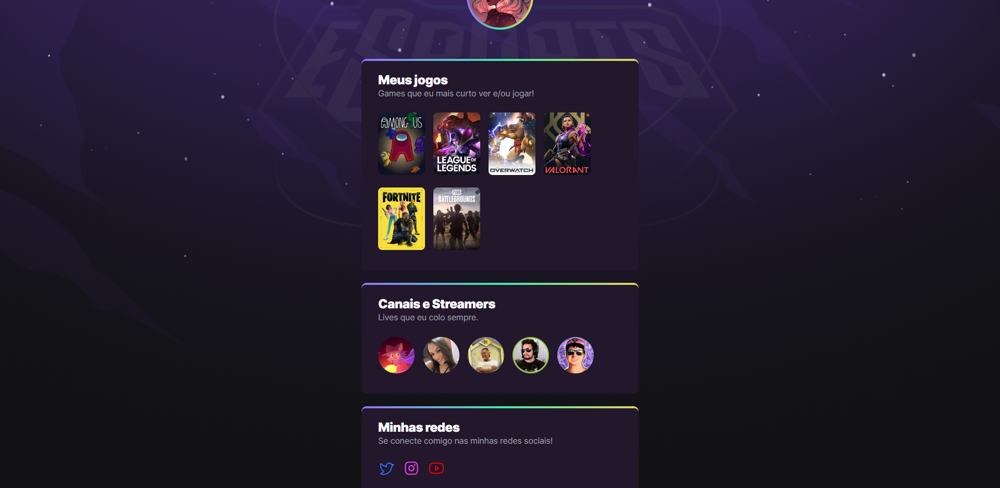

# NLW eSports - Trilha Explorer

Projeto construído no evento Next Level Week da [Rocketseat](https://github.com/rocketseat-education), sob orientação do [Mayk Brito](https://github.com/maykbrito).

🔗 [Clique aqui para acessar](https://yorudev9.github.io/NLW_Explorer/)

## 🔧 Tecnologias

- HTML
- CSS

## ✉️ Contato
[Email - lizalves.dg@gmail.com](lizalves.dg@gmail.com) | 
[Linkedin](https://www.linkedin.com/in/larissaalveslsa)

_Há diversas anotações no CSS. Essa foi a primeira vez em que usei animações e, contra o que eu sempre imaginei, é extremamente fácil de se fazer animações com o CSS, mas creio que isso fala mais sobre a didática do Mayk, que mostrou de forma bem simples a lógica por trás da aplicação das animações, do que efetivamente minhas habilidades._

_Aqui eu aprendi coisas novas e apliquei coisas antigas (como as variáveis) que tive a chance de aprender e tento sempre fazer uso das mesmas, já pensando na manutenção do código._

_Em breve vou adicionar os nomes dos jogos e streamers em modo hover._
